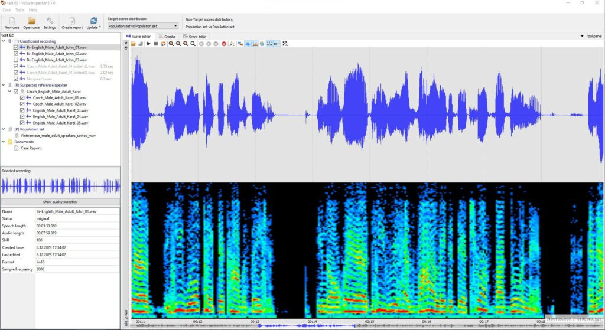
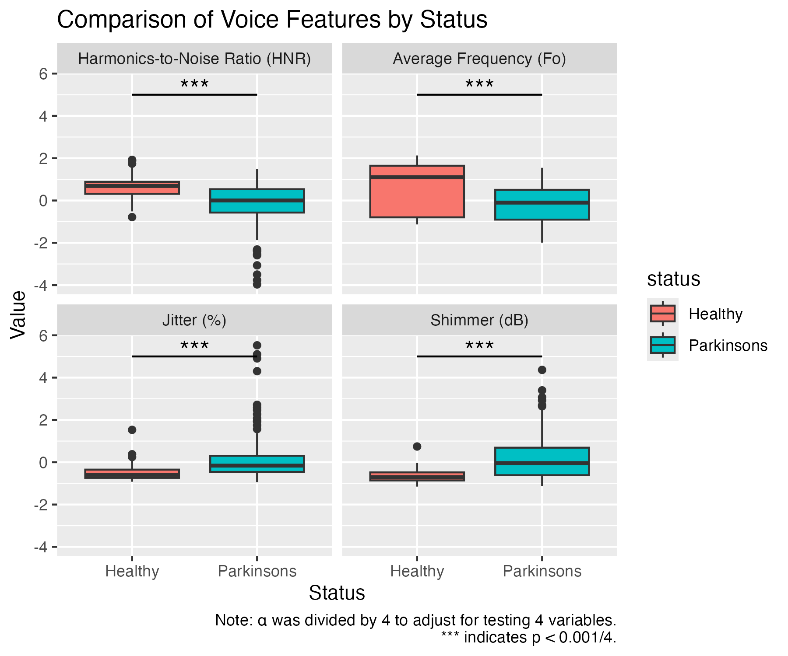
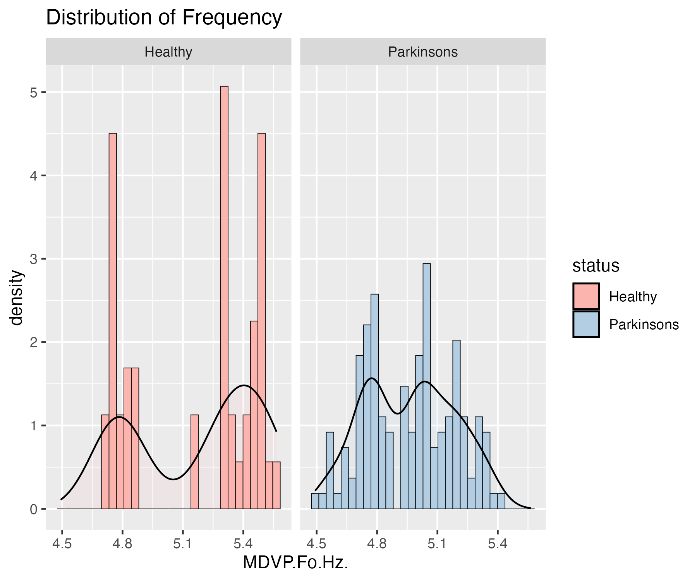

```{r, include=FALSE}
knitr::write_bib(c('knitr','rmarkdown','posterdown','pagedown'), 'packages.bib')
```

```{r setup, include=FALSE}
knitr::opts_chunk$set(echo = FALSE)
library(knitr)
library(tidyverse)
```

# Introduction

Parkinson’s disease (PD) affects motor control of the vocal folds, producing measurable acoustic changes in speech. PD often affects the voice stability and clarity. My project investigates whether specific vocal features (including fundamental frequency (Fo), jitter (frequency variation), shimmer (amplitude variation), and harmonics-to-noise ratio (HNR)) differ between healthy individuals and those diagnosed with PD. These analyses evaluate whether vocal instability can serve as a potential low-cost biomarker for PD detection.


# Research Questions / Hypotheses

1. Are vocal features significantly different between Healthy and Parkinson’s individuals?  
2. **Hypothesis:** Compared to healthy individuals, PD patients will show...
   - lower vocal frequency  
   - higher jitter and shimmer  
   - lower HNR 

# Methods

- Dataset includes 195 voice recordings from 31 individuals (23 with Parkinson’s disease).  
- Measures analyzed: **Fo**, **Jitter**, **Shimmer**, **HNR**, and **status (Healthy vs PD)**.  
- All acoustic variables were log(1 + x) transformed due to heavy skew.  
- Normality and variance assumptions were tested using histograms, QQ-plots, Shapiro–Wilk, and Fligner tests.  
- Because all variables violated assumptions, **Wilcoxon rank-sum tests** were used for group comparisons.  
- Figures were generated in R (ggplot2) and saved into the `figures/` directory.

```{r}


```
*Figure 1. Example of the voice-recording setup used to generate the acoustic features in the Parkinson’s dataset*

# Results

```{r}

```
*Figure 2. Boxplot showing distribution of transformed vocal features by PD status. PD individuals showed significantly lower Fo and HNR, and significantly higher Jitter and Shimmer (all p < 0.05).This supports the hypothesis that PD affects multiple acoustic features.*


```{r}
knitr::include_graphics("../figures/violin.png")
```
*Figure 3. Violin plot showing the full distributional shape of transformed vocal features by PD status. Plots reveal skewness, spread, and multimodality in each feature’s distribution. PD individuals show visibly broader and more asymmetric distributions for Jitter and Shimmer, indicating greater vocal instability.*

# Next Steps

```{r}

```
*Figure 4. Frequency Histogram showing bimodal, non normal distributions of data, which validates the use of nonparametric tests.*

```{r}
knitr::include_graphics("../figures/scatterplots.